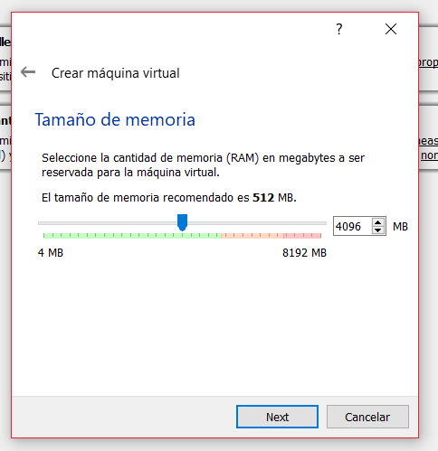

# Centos
Como instalar y configurar centos7 en la maquina virtual virtualbox
## Instalacion
#### 1. Se crea una nueva maquina virtual

  

#### 2. Selecciona el el tipo de sistema operativo que instalaras en la maquina virtual

  

#### 3. Selecciona la cantidad de ram que ocupara el S.O.

  

